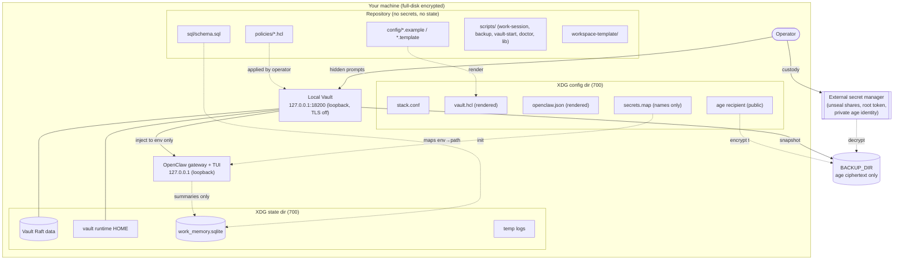
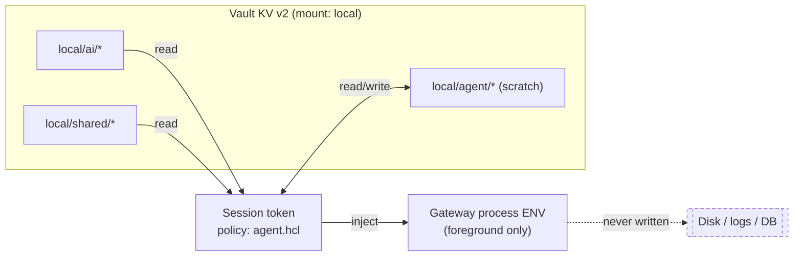
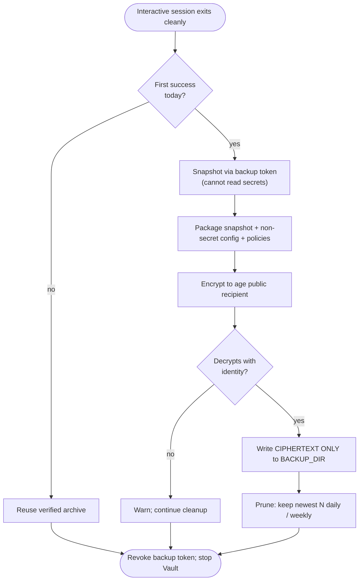

# Architecture

The stack is a small set of cooperating parts on a single machine. This page
describes the components, the session lifecycle, the secret-injection path, and
the backup flow, with Mermaid diagrams.

## Components



## Session lifecycle

```mermaid
sequenceDiagram
    autonumber
    actor Op as Operator
    participant L as work-session (foreground)
    participant V as Local Vault (loopback)
    participant G as OpenClaw gateway/TUI
    participant B as BACKUP_DIR

    Op->>L: start session
    L->>L: refuse conflicting service/listener
    L->>V: start Vault as owned child
    Op-->>V: unseal shares + admin password (hidden)
    L->>V: mint short-lived token (agent policy)
    V-->>L: session token (env only)
    L->>V: read mapped secrets (secrets.map)
    V-->>L: secret values
    L->>G: inject secrets into gateway ENV only
    L->>G: open TUI (loopback)
    Op->>G: do work
    Op->>G: /exit (or Ctrl-D / double Ctrl-C)
    G-->>L: TUI closed
    L->>G: stop gateway
    L->>V: (optional) snapshot via backup token
    L->>B: write age-encrypted archive
    L->>V: revoke session + backup tokens
    L->>V: stop Vault
    L->>L: remove temp logs
    Note over Op,B: Sleep/interrupt/power-loss ends the session;<br/>a forced kill can bypass cleanup.
```

## Secret-injection path (least privilege)



The `agent` policy can read AI/service and shared secrets and keep small values
under its own prefix — nothing else. Secrets flow into the live process
environment and are **never** persisted to disk, logs, or the memory database.

## Backup flow



Startup failures never produce a backup. Only files matching the encrypted-backup
naming pattern are ever pruned, and the newest recovery point is never removed.

## Design principles reflected in the diagrams

- **One machine, loopback only.** No component listens on a routable address.
- **Foreground and owned.** The launcher owns Vault and the gateway as child
  processes; closing it tears them down.
- **Least privilege end to end.** Distinct policies for operator, agent, and
  backup; the backup path cannot read secrets, and the agent path cannot manage
  Vault.
- **Operator holds the crown jewels.** Unseal shares, root token, and the private
  `age` identity live in external custody, never in the repo or state dir.
- **Ciphertext leaves; plaintext never does.** The only external artifact is an
  age-encrypted archive.

See [`SECURITY.md`](SECURITY.md) for the controls behind these shapes and
[`OPERATIONS.md`](OPERATIONS.md) for how to drive them.
